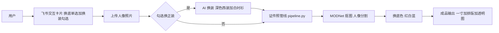

# 证件照智能生成 Skill（id-photo-dressing）

一个把普通生活照变成**合规证件照**、还能**一键换正装**的 AI Skill：底层用开源项目 [HivisionIDPhotos](https://github.com/zifeiyu0721/HivisionIDPhotos) 完成抠图 / 换底 / 排版，上层用 AI 图像编辑实现「便装换深色西装」，再通过飞书交互卡片引导用户一步步完成。项目已固化为可分享、可一键初始化环境的 Skill。

从上传生活照到拿到合规一寸证件照（300DPI、六寸排版可冲印），全程约 1 秒；要正装？AI 帮你穿上。

## 快速开始

### 前置条件

| 工具 | 版本要求 | 怎么装 |
|---|---|---|
| python3 | 3.8+ | Ubuntu: `apt install python3`；Windows 用 WSL 或官网安装包 |
| git | 任意 | `apt install git` |
| curl | 任意 | `apt install curl` |

### 初始化环境

```bash
# 一键初始化：clone 开源项目 + 下载抠图模型 + 建虚拟环境 + 装依赖 + 冒烟测试（幂等，可重复执行）
bash id-photo-dressing/scripts/setup.sh
```

### 最小可运行示例

```bash
# 生成一寸蓝底证件照（438edb 是蓝色 hex）
python id-photo-dressing/scripts/pipeline.py 我的照片.jpg out/ --bg 438edb

# 二寸白底：换底色和尺寸即可
python id-photo-dressing/scripts/pipeline.py 我的照片.jpg out/ --bg ffffff --width 413 --height 579
```

成功后 `out/` 目录出现 3 个文件：标准证件照 `295x413.png`（300DPI）+ 高清透明图 + 六寸排版照（2×5 可直接冲印）。

## 架构



## 模块职责

| 模块 | 职责 | 关键点 |
|---|---|---|
| `scripts/pipeline.py` | 证件照主流程：抠图 → 美颜 → 人脸检测 → 换底 → 排版 | 一次输出 3 个规格，一寸照 300DPI |
| `scripts/repaint_bg.py` | 对已有透明图换红/白/蓝底 | 一行命令即可换底 |
| AI 换装（image_edit） | 便装 → 深色西装 + 白衬衫 | 约束面部/发型/姿态不变 |
| `scripts/setup.sh` | 环境一键初始化（幂等） | clone → 模型 → venv → 依赖 → 冒烟测试 |
| `scripts/package.sh` | 生成可分享压缩包 | 自动排除 runtime（venv 不可移植） |
| `references/idphoto-card.json` | 飞书交互卡片模板 | Card 2.0：换底单选 + 换装勾选 |

## 技术原理

- **MODNet 抠图**：实时人像分割模型（约 25MB），CPU 单张推理 < 0.8s，不用 GPU 也能实时出图。
- **AI 换装**：以原照片为参考图，指令模型把衣物区域重绘为「深色西装 + 白衬衫」，约束面部、发型、姿态不变。免 GPU、效果稳定。
- **setup.sh 幂等设计**：每一步先检查「目标是否已存在」，失败可重跑、增量补装，保证分享到别人机器上第一次就能跑通。

## 分享与复用

分享包只含 `SKILL.md + scripts/ + references/`，不含本机虚拟环境和模型（不可移植、体积大）。对方拿到后放进 `.user_skills` 目录，执行一次 `bash scripts/setup.sh` 即完成初始化：

```bash
bash scripts/package.sh   # 一键生成不含 runtime 的分享压缩包
```

## 常见问题

| 问题 | 一句话解法 |
|---|---|
| setup.sh 报缺少 git / curl | 先装：`apt install git curl` |
| 模型下载慢或失败 | 重跑 setup.sh，已下载的部分自动跳过 |
| 多人合照 / 侧脸被拒绝 | 换单人、正脸、光线均匀的照片 |
| 排版照中文水印乱码 | 需要文泉驿正黑字体（wqy-zenhei），setup.sh 会处理 |

## License

本项目作为 Skill 分享；底层开源项目 HivisionIDPhotos 与可选换装模型 IDM-VTON（CC BY-NC-SA 4.0 非商用）遵循各自协议。
